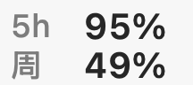

# Codex Usage Bar

一个轻量的 macOS 菜单栏工具，持续显示 Codex 的剩余额度，并提供可置顶的独立窗口。



上行为 5 小时额度，下行为每周额度，数字均表示**剩余百分比**。图片放大 4 倍便于查看，数值为示例；实际菜单栏常规宽度为 54 pt。

## 下载

[下载 macOS Apple Silicon 版](downloads/CodexUsageBar-macos-arm64.zip)，解压后运行 `CodexUsageBar.app`。升级时先从旧版菜单中选择「退出」，再打开新版。

当前下载版本为 1.3.0，使用本地临时签名，未经 Apple 公证。Intel Mac 请按下方步骤从源码构建。

## 功能

- 显示 5 小时和每周的剩余百分比，支持服务返回的其他用量周期。
- 菜单栏采用上下两行：`5h 95%` / `周 49%`，常见周期占约 54 pt 宽度。等宽数字和固定宽度避免刷新时跳动；示例数值仅用于说明。
- 每行百分比下方带细进度线；使用原生模板图像，由 macOS 根据菜单栏背景及选中状态自动调整所有文字和线条的颜色。鼠标悬停显示完整周期和更新时间。
- 可开启「随 Codex 打开／退出」：Codex 启动时自动打开小工具，最后一个 Codex 应用进程退出时关闭小工具。
- 每 60 秒自动刷新，电脑唤醒后刷新，也可手动刷新。
- 点击菜单栏查看分组额度卡片：每个周期的剩余百分比与重置时间放在同一张卡片中，使用随系统明暗模式变化的正常信息文字，避免被渲染成浅灰禁用项。也可打开独立窗口。
- 支持多个用量桶；菜单栏显示主要桶，菜单和窗口显示全部桶。
- 短暂超时、请求失败或查询进程退出时，等待 2 秒自动重连重试一次。重试期间保留上次数据；两次均失败才显示异常标记。登录失效等明确错误直接提示。
- 查询失败时保留上次数据和最后成功更新时间，区分超时、登录失效、请求被拒绝、服务繁忙及本地服务退出。感叹号表示用量未能刷新，不表示 Codex 应用已断线。

此工具显示的是 **Codex 额度**。它不代表所有 ChatGPT 模型的剩余用量，也不是 OpenAI 官方应用。

## 环境要求

- macOS 13 或更新版本。
- 本机已安装并登录 ChatGPT/Codex。支持应用内置 Codex CLI，以及 `/opt/homebrew/bin/codex` 或 `/usr/local/bin/codex`。
- 从源码构建需要 Swift 编译器和 macOS SDK（Xcode Command Line Tools）。

## 构建与运行

```sh
bash scripts/build.sh
open dist/CodexUsageBar.app
```

脚本按当前 Mac 的架构构建应用，生成 `dist/CodexUsageBar.app` 和 `dist/CodexUsageBar.zip`。构建过程在临时目录签名，避免云盘文件属性影响签名。

应用默认只出现在菜单栏。点击菜单中的「显示独立窗口」打开可置顶窗口；关闭窗口后仍在菜单栏运行。完全退出请选择菜单中的「退出」。

## 随 Codex 启停

将应用放在固定位置（推荐 `~/Applications/CodexUsageBar.app`），在菜单中勾选「随 Codex 打开／退出」。开启后：

- Codex 打开时，小工具自动启动，不抢焦点；已经运行时不会重复启动。
- 退出 Codex 应用时，小工具随之退出。只关闭一个 Codex 窗口、但应用仍在运行时，小工具继续运行。
- 手动退出小工具后，不会反复拉起；下次打开 Codex 时再启动。
- 取消勾选会关闭联动，恢复独立运行。

联动通过当前用户的 macOS LaunchAgent 和随应用附带的 `CodexUsageWatcher` 助手实现。助手只监听应用启动和退出事件，不轮询账户、不查询额度、不需要管理员权限。启用后每次登录会恢复监听；若 Codex 当时已运行，也会启动小工具。配置位于 `~/Library/LaunchAgents/local.codex.usagebar.watch-codex.plist`。移动应用后，请重新关闭再开启联动以更新路径。

也可通过命令行设置：

```sh
~/Applications/CodexUsageBar.app/Contents/MacOS/CodexUsageBar --enable-autostart
~/Applications/CodexUsageBar.app/Contents/MacOS/CodexUsageBar --disable-autostart
```

卸载前先取消勾选联动，再删除应用。

## 用量与登录

通过本机 Codex app-server 的官方 `account/rateLimits/read` 接口读取账户用量，复用本机 Codex 登录状态。不需要 API Key，不复制或导出登录凭据，也不启动模型对话。Codex 自身负责账户认证和运行时数据。

剩余百分比为 `100 − usedPercent`，限制在 0–100% 之间。缺失的数据不会视为 0；重置时间按系统本地时区显示。

验证实际查询：

```sh
dist/CodexUsageBar.app/Contents/MacOS/CodexUsageBar --check
```

运行查询回归测试（需要 Python 3 和 Swift）：

```sh
bash scripts/test.sh
```

## 源码结构

```text
Sources/main.swift      用量查询、菜单栏、独立窗口与启停设置
Sources/Watcher.swift   监听 Codex 启动和退出的后台助手
Resources/Info.plist    macOS 应用元数据
scripts/build.sh        本机构建、签名与打包
```

官方接口文档：[Codex App Server](https://learn.chatgpt.com/docs/app-server)。
